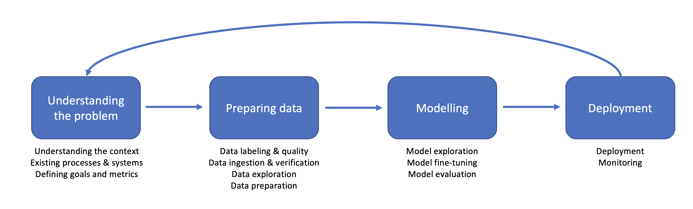

# HVL-ML entry in the 2022 NORA MapAI challenge
## Team
<a href="https://skaliy.no/">Satheshkumar Kaliyugarasan</a> and <a href="https://alexander.lundervold.com/">Alexander S. Lundervold</a> 

<p style="margin-left:5%"><a href="https://www.hvl.no/om/organisering/fin/institutt-for-datateknologi-elektroteknologi-og-realfag/">Department of Computer Science, Electrical Engineering and Mathematical Sciences</a>, Faculty of Engineering and Science, Western Norway University of Applied Sciences, Bergen, Norway.</p><br>
<p align="center"></p>


## Introduction
<center><br>
<small>The figure show's one of our model's predictions on validation data from an external dataset used for pretraining.</small>
</center>

## Citing

[S. Kaliyugarasan, and A. S. Lundervold. *LAB-Net: Lidar and aerial image-based building segmentation using U-Nets*. Nordic Machine Intelligence (2023)](https://journals.uio.no/NMI/article/view/10163). 

BibTeX entry:

```bibtex
@article{kaliyugarasan2022lab,
  title={{LAB-Net}: Lidar and aerial image-based building segmentation using {U-Nets}},
  author={Kaliyugarasan, Satheshkumar and Lundervold, Alexander Selvikv{\aa}g},
  journal={Nordic Machine Intelligence},
  volume={2},
  number={3},
  year={2023}
}
```


## Our approach



See also our team's code in the competiton repo: https://github.com/Sjyhne/MapAI-Competition (*team_hvlml*).


_Details TBA_


#### Data preparation
<!--- Extensive filtering work. PNGs of some mislabeled images.
##### List of training images filtered out: 
_Add CSV file_
-->

#### Modelling
<!--- Pretraining: https://project.inria.fr/aerialimagelabeling/files/. _Add download instructions for this somewhere? Perhaps it should be in a notebook `00b_inria_prepare_data.ipynb`? E.g. 
```python
!wget https://files.inria.fr/aerialimagelabeling/getAerial.sh
if os.path.exists(INRIA_DATA/'AerialImageDataset'):
    print('Already extracted')
else:
    !wget -nc --no-check-certificate https://files.inria.fr/aerialimagelabeling/aerialimagelabeling.7z.001 -P $INRIA_DATA
    !wget -nc --no-check-certificate https://files.inria.fr/aerialimagelabeling/aerialimagelabeling.7z.002 -P $INRIA_DATA
    !wget -nc --no-check-certificate https://files.inria.fr/aerialimagelabeling/aerialimagelabeling.7z.003 -P $INRIA_DATA
    !wget -nc --no-check-certificate https://files.inria.fr/aerialimagelabeling/aerialimagelabeling.7z.004 -P $INRIA_DATA
    !wget -nc --no-check-certificate https://files.inria.fr/aerialimagelabeling/aerialimagelabeling.7z.005 -P $INRIA_DATA
    archives = sorted(list(INRIA_DATA.glob('*.7z*')))
    for archive in archives:
        !7z x -aos aerialimagelabeling.7z.001
        !unzip -n NEW2-AerialImageDataset.zip
```

- Data augmentation
-->

#### Deployment


## Results

_Add results on validation data_

## Setup
If you only want to produce predictions on new data, then you can install our inference environment by following the instructions below. However, if you're going to re-run or modify the training process, please install the libraries in our more extensive training environment.
<details>
    <summary>Click for installation instructions</summary>


### Inference environment
#### Clone the repo:

`git clone https://github.com/skaliy/MapAI_challenge`

#### Create conda environment: 
```bash
cd MapAI_challenge
conda env update -f environment-inference.yml
```


### Training environment
#### Clone the repo and its submodules:
`git clone --recurse-submodules https://github.com/skaliy/MapAI_challenge`

#### Create conda environment: 
```bash
cd MapAI_challenge
conda env update -f environment-training.yml
conda activate mapai
```

#### Install PyTorch:
Follow the instructions at https://pytorch.org/get-started/locally/. E.g.,
```bash
conda install pytorch torchvision torchaudio pytorch-cuda=11.7 -c pytorch -c nvidia
```

#### Install fastai, 🤗 datasets, and kornia:
```bash
conda install -c fastchan fastai
pip install datasets
pip install kornia
```

#### Install the data augmentation submodule:
```bash
pip install -e 'semantic_segmentation_augmentations[dev]'
```

</details>
<br>

# Table of contents

Note that the TOC is a bit outdated.

### Data preparation
| Notebook    |      Description      |
|:----------|------|
|  [00a_prepare_mapai_data.ipynb](nbs/00a_prepare_mapai_data.ipynb)| Loads the MapAI data and computes and stores information about which images the "ground truth" masks indicate have buildings and to what extent. 
|  [00b_inria_prepare_data.ipynb](nbs/00b_inria_prepare_data.ipynb)| Loads and extracts images patches from the INRIA dataset used for pretraining 

### Data cleaning
| Notebook    |      Description      |
|:----------|------|
|  [01a_classifier.ipynb](nbs/01a_classifier.ipynb)| Trains a building detection classifier used to discover mislabeled data.
|  [01b_inspect_diff.ipynb](nbs/1b_inspect_diff.ipynb)| Our filtering process to find mislabeled images is only partially automatic. This notebook contains code for a manual step investigating possible mislabels.
|  [01c_manual_find_error.ipynb](nbs/01c_manual_find_error.ipynb)| Code for a manual step investigating possible mislabels.
|  [01d_segmentation_cleaning.ipynb](nbs/01d_segmentation_cleaning.ipynb)| We repeat the above filtering process to discover even more mislabeled data, but this time using a segmentation model. 
|  [01e_segmentation-pretraining-cleaning.ipynb](nbs/01e_segmentation-pretraining-clearning.ipynb)| Use the pretrained segmentation model to filter mislabeled data 


### Segmentation
| Notebook    |      Description      |
|:----------|------|
|  [02a_segmentation-pretraining.ipynb](nbs/02a_segmentation-pretraining.ipynb)| Pretrains our segmentation models on the INRIA dataset described above. 
|  [02b_segmentation-pretraining-evaluate.ipynb](nbs/02b_segmentation-pretraining-evaluate.ipynb)| Evaluate the pretrained model. Visualize predicted results. 
|  [02c_segmentation-aerial.ipynb](nbs/02c_segmentation-aerial.ipynb)| Fine-tunes the above model on the MapAI data
|  [02d_segmentation-lidar.ipynb](nbs/02d_segmentation-lidar.ipynb)| Trains a segmentation model on the lidar data

### Inference on new data
| Notebook    |      Description      |
|:----------|------|
|  [03a_inference_aerial.ipynb](nbs/03a_inference_aerial.ipynb)| Inference on new aerial images using our top-performing model ensemble.
|  [03b_inference_lidar.ipynb](nbs/03b_inference_lidar.ipynb)| Inference on new lidar data using our top-performing model ensemble.
